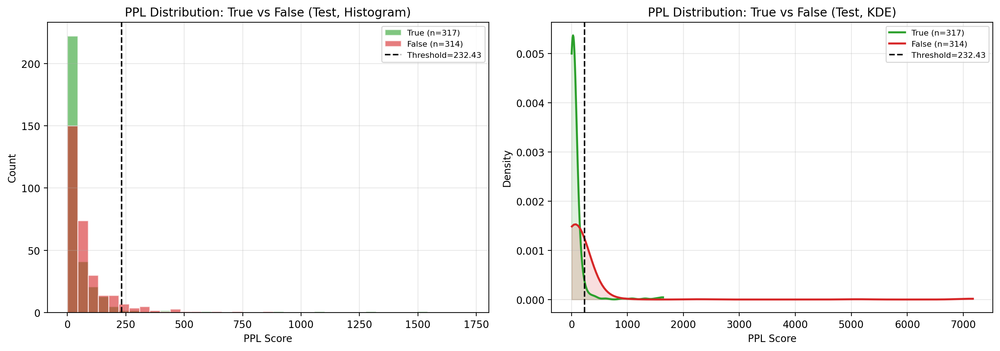
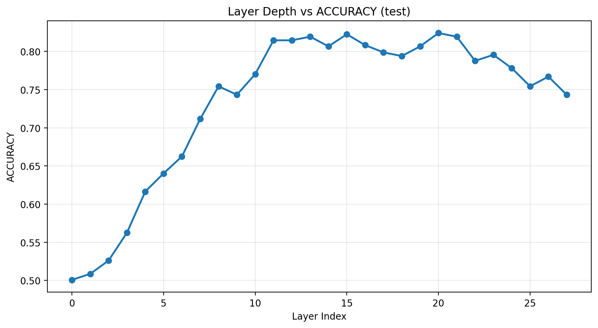
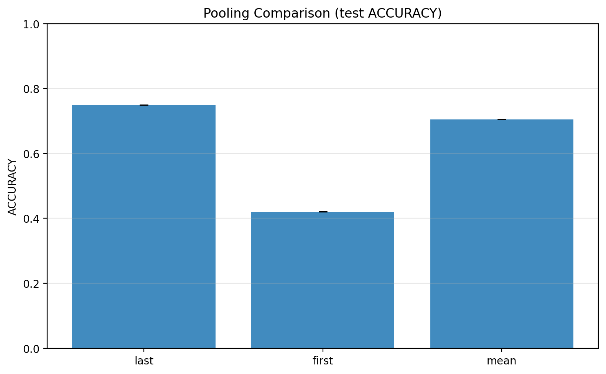
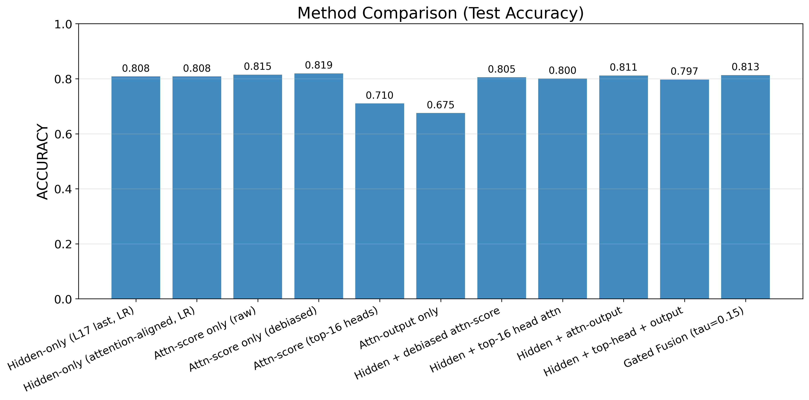
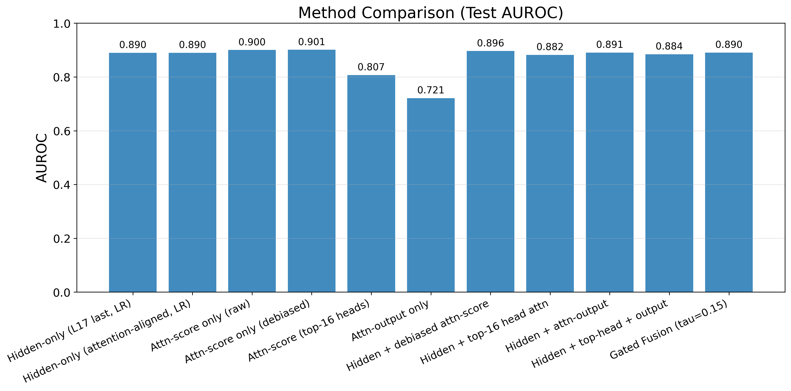
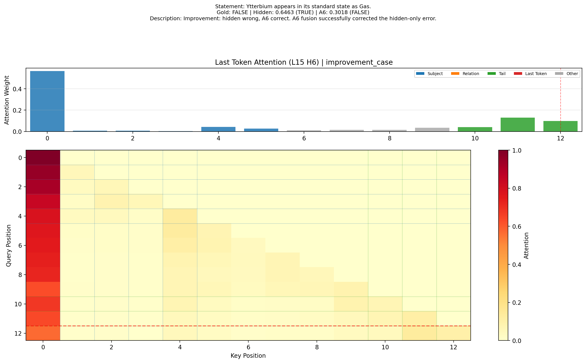

# 利用大语言模型内部状态进行幻觉检测：阶段性实验报告

> 版本：Draft v0.5
> 更新时间：2026-05-31
> 项目目录：`LLMHallucinationProbing/`

---

## 摘要

大语言模型在生成任务中展现出强大的语言理解与表达能力，但其“幻觉”问题仍然是影响可靠应用的关键瓶颈。与依赖外部知识库或检索系统的方法不同，基于模型内部状态的幻觉检测尝试直接利用模型自身对陈述真实性的内部表征进行判断。本项目围绕论文 _The Internal State of an LLM Knows When It's Lying_ 的核心思想，基于 Qwen2-1.5B 模型和 True-False Dataset，系统实现并评估了 PPL、SAPLMA、逐层隐藏状态分析、token pooling 分析，以及基于注意力特征的 Phase 4 进阶优化方案。

Phase 2 基线结果显示，PPL 在测试集上的 Accuracy 为 0.5293、Macro-F1 为 0.4180、AUROC 为 0.6784；在固定最后层与 `last` token 设置下，重跑后的 SAPLMA-MLP 测试集平均 Accuracy 为 0.7771、Macro-F1 为 0.7769、AUROC 为 0.8770。Phase 3 进一步表明，真实性相关信号并不在最后层最强：对 28 个 Transformer block 的 `last` token 做逐层分析后，验证集最优层为 layer 17，其测试集 Accuracy 为 0.8003、Macro-F1 为 0.8001、AUROC 为 0.8876；在最后层的 token 表示比较中，`last` pooling 优于 `mean` pooling 和 `first` pooling，测试集 Accuracy 分别为 0.7496、0.7052 和 0.4200。

Phase 4 复测进一步发现，在 Linux + RTX 3090 环境下，`eager + float16` 仍会产生 NaN，真正稳定的运行路径是 `eager + bfloat16`。在该设置下，全量 hidden-only baseline 达到 Accuracy 0.8082、Macro-F1 0.8081、AUROC 0.8897；全量 A0-A9 消融表明，去长度偏置后的 attention-score only 方法 A2 达到 Accuracy 0.8193、Macro-F1 0.8193、AUROC 0.9010，是当前 A0-A9 attention-guided 消融中的最佳方法。融合类方法没有稳定超过 A2：A9 gated fusion 仅带来 +3 的轻微净修正，A6 top-head 融合总体 Accuracy 为 0.8003，低于 hidden-only baseline。这些结果说明 attention score 本身已经是强判别信号，而复杂融合与 head selection 的收益边界比早期小样本实验更窄。本报告据此总结 Phase 1 至 Phase 4 的实现、核心方法、实验结果与工程结论。

**关键词**：幻觉检测；大语言模型；隐藏状态；注意力特征；SAPLMA；Qwen2-1.5B

---

## 1. 引言

大语言模型（Large Language Models, LLMs）已经在问答、文本生成、推理和信息抽取等任务中取得显著进展。然而，这类模型经常会生成语法自然但事实错误的内容，即所谓“幻觉（hallucination）”。这一问题在知识密集型场景中尤为突出，例如教育、医疗、法律和科研辅助等领域。由于模型常以较高置信度输出错误内容，用户往往难以及时识别风险，因此如何检测幻觉已成为大模型可靠性研究的重要方向。

已有研究中，幻觉检测方法可以大致分为两类。第一类方法依赖外部知识库、检索系统或事实验证组件，通过将模型输出与外部证据进行比对来判定真实性。这类方法通常能够借助外部知识增强准确性，但会增加系统复杂度，并且依赖额外的知识来源。第二类方法则聚焦于模型自身，试图通过模型输出概率、隐藏状态、注意力分布或其他内部激活来判断模型是否“知道”一条陈述是真是假。相比外部校验，这种内部探测路线更具模型分析意义，也更符合“从模型自身认知状态中读取信号”的研究目标。

本项目采用第二类思路，以论文 _The Internal State of an LLM Knows When It's Lying_ 为主要参考，围绕 True-False Dataset 中的陈述句开展实验。项目首先实现两类基线方法：其一是基于序列困惑度的 PPL 方法，其二是基于隐藏状态分类的 SAPLMA 方法。随后，项目继续分析不同层深度、不同 token 位置表示对真实性检测的影响，并进一步实现基于 attention score 与 attention output 的进阶优化方案。

本报告对应项目当前的阶段性实验结果汇总，覆盖已完成的 Phase 1、Phase 2、Phase 3 与 Phase 4。报告既总结基线方法与表示分析，也整理 attention-guided 进阶方案的实现思路、核心消融结果与工程经验。

---

## 2. 相关工作

### 2.1 幻觉检测研究概述

大语言模型幻觉检测的研究通常从两个方向展开。一类工作强调外部知识增强，包括检索增强生成（RAG）、外部事实校验、多轮验证等；另一类工作则关注模型内部机制，希望不借助外部知识，直接从模型对文本的内部响应中检测其不确定性或知识缺失状态。

外部知识增强方法在应用层面较为实用，但其检测效果往往依赖检索质量、知识库完整性以及检索-生成协同机制。相比之下，内部状态方法更适合用来回答一个更基础的问题：模型自身的内部表示中，是否已经编码了足以区分真实与虚假陈述的信号？

### 2.2 基于概率的方法

最直观的内部方法是使用模型对一段文本的生成概率或序列困惑度作为真实性判断依据。直觉上，如果模型“更认可”某条陈述，那么它在生成这条陈述时的损失应更低、PPL 也应更低。然而，这类方法存在明显局限：PPL 不仅受到事实性影响，也会受到句长、词频、表面流畅度、措辞习惯等因素影响。因此，PPL 更多反映的是模型的语言接受度，而不一定等价于事实真实性。

### 2.3 基于隐藏状态的探测方法

论文 _The Internal State of an LLM Knows When It's Lying_ 提出，模型在处理文本时的隐藏状态中可能已经编码了关于真实性的信息。SAPLMA 方法正是这一思路的代表：它提取某一层、某一 token 位置的隐藏状态作为特征，再训练轻量分类器判断真假。这种方法将真实性检测问题转化为一个表征探测问题，相对于 PPL 更少受到表面文本统计特征的干扰，也更有利于进行层深度和 token 位置分析。

### 2.4 本项目的工作定位

本项目聚焦于课程要求中的基础任务、分析任务与进阶优化任务，已在统一实验设置下完成以下工作：

1. 实现并对比 PPL 与 SAPLMA 两类基线方法；
2. 对 28 个 Transformer block 开展逐层隐藏状态分析，考察哪些层编码了更多真实性相关信息；
3. 在最后层设置下比较 First / Last / Mean pooling 的效果差异；
4. 设计并实现以 attention score / output 为核心的进阶优化方案，包括 anchor 抽取、去长度偏置、head selection、融合分类与系统消融分析。

因此，本项目当前不仅完成了“内部状态是否可用于幻觉检测”的基础验证，也进一步回答了“注意力特征能否为隐藏状态基线提供互补信息”这一更具体的问题。

Phase 4 的价值体现在最终选出 A2 作为 A0-A9 attention-guided 消融中的最优方法，也体现在完整探索了多类注意力使用路径：原始 attention score、长度去偏 score、validation-based top-head selection、attention output activation、hidden-attention 拼接、三路融合、gated routing、样本级错误修正矩阵和 attention case 可视化。全量结果中 A6/A8/A9 没有超过 A2，验证了“复杂融合并不自动带来收益”这一边界。

---

## 3. 方法

### 3.1 问题定义

给定一条陈述句 \(x\)，任务是预测其真假标签 \(y \in \{0,1\}\)，其中 1 表示真实陈述，0 表示虚假陈述。本项目使用 True-False Dataset 作为主要数据来源，输入以陈述句形式给出，任务形式为 statement-level 文本二分类。分类特征来自语言模型的内部状态或语言建模分数。

### 3.2 基于生成概率的 PPL 方法

PPL 方法将一条陈述句送入因果语言模型，直接计算该句子的长度归一化损失，并以

\[
\text{PPL}(x) = \exp(\mathcal{L}(x))
\]

作为连续判别分数。PPL 越低，表示模型越“认可”该陈述。为了将连续分数转为真假分类，本项目在验证集上搜索最优阈值，再将该阈值固定到测试集进行最终评估。

当前实现中，PPL 方法的核心流程包括：

1. 对单条语句或批量语句进行 tokenize；
2. 调用语言模型前向传播并使用 `labels=input_ids` 获取平均 loss；
3. 将 loss 指数化得到 PPL；
4. 在验证集上搜索最优判别阈值；
5. 在测试集上汇报 Accuracy、Macro-F1 和 AUROC。

对应实现文件：`src/methods/probability.py`。

### 3.3 基于隐藏状态分类的 SAPLMA 方法

SAPLMA 方法将真假判别视为对模型内部表征的探测。对输入陈述句进行前向传播后，提取指定 Transformer block 的隐藏状态表示，作为下游分类器的输入特征。根据项目计划与当前实现，层编号统一按 Transformer block 输出编号，不将 embedding output 计入层号。

当前 Phase 2 的基础实现采用“最后一个 token 的隐藏状态”作为整句表示，即：

1. 对输入语句执行前向传播并开启 `output_hidden_states=True`；
2. 显式剥离 `hidden_states[0]` 对应的 embedding output；
3. 从指定层中取最后一个有效 token 的表示；
4. 将隐藏状态送入轻量分类器（逻辑回归或 MLP）；
5. 在测试集上汇报多随机种子下的均值与标准差。

对应实现文件：

- 隐藏状态提取：`src/features/hidden_states.py`
- SAPLMA 分类：`src/methods/saplma.py`

### 3.4 分类器设计

当前 SAPLMA 实现包含两类下游分类器：

- **Logistic Regression**：作为线性基线，适合衡量隐藏状态中特征是否已具有较好的线性可分性；
- **MLPClassifier**：引入非线性映射能力，用于探索隐藏状态中更复杂的真假判别边界。

在训练前，特征先通过 `StandardScaler` 进行标准化。当前配置中，随机种子固定为 `(42, 123, 2024)`，以减少单次训练带来的偶然波动，并报告测试集结果的均值与标准差。

### 3.5 扩展分析方法

在基线方法之外，项目当前已完成三类扩展分析：

- **层深度分析**：逐层提取 28 个 Transformer block 的隐藏状态，并训练逻辑回归分类器，绘制层深度-性能曲线；
- **token 位置分析**：在最后层固定设置下比较 `Last`、`First` 与 `Mean pooling` 的效果差异；
- **Phase 4 进阶优化分析**：围绕陈述句 anchor 抽取、layer / head 级 attention score 特征、去长度偏置、validation-based head selection、attention output activation，以及 hidden-attention 融合分类器展开系统消融。

对应实现文件包括：

- Phase 3 分析：`src/analysis/layer_analysis.py`、`src/analysis/token_analysis.py`
- Phase 4 特征与方法：`src/features/anchor_extraction.py`、`src/features/attention_scores.py`、`src/features/attention_outputs.py`、`src/methods/phase4_attention.py`
- Phase 4 结果分析：`src/analysis/phase4_analysis.py`

---

## 4. 实验设置

### 4.1 模型

本项目当前统一使用 **Qwen2-1.5B** 作为实验模型。选择该模型的主要原因如下：

1. 在当前 Linux + RTX 3090 环境下可稳定运行；
2. 参数规模较适中，既能完成完整前向传播和隐藏状态提取，也便于多次实验复用；
3. 与课程要求中“若较大模型本地跑不动，可选 Qwen2-1.5B”这一条件一致。

当前模型缓存路径为：`models_cache/Qwen2-1.5B/`。

需要特别说明的是，Phase 4 在当前环境下验证到 `eager + float16` 仍会产生 NaN，因此现行主线实验统一采用 `eager attention + bfloat16`。这一设置已经同步到项目默认配置，并作为当前报告中 Phase 4 结果的唯一有效运行路径。

### 4.2 数据集

实验数据采用 True-False Dataset 的陈述句形式。当前工作区中的 `data/raw/` 已以 CSV 方式组织，包含如下原始文件：

- `animals_true_false.csv`
- `cities_true_false.csv`
- `companies_true_false.csv`
- `elements_true_false.csv`
- `facts_true_false.csv`
- `generated_true_false.csv`
- `inventions_true_false.csv`

其中前 6 个主要领域与课程说明中的数据集范围一致，`generated_true_false.csv` 为当前工程配置下同时纳入的附加原始文件。本文所有主要结论均在包含 generated subset 的固定划分上报告；该扩展保留了课程指定六领域的主体设置。

### 4.3 数据划分与预处理

项目采用 8:1:1 的训练集、验证集、测试集划分。当前实现中，`src/data/preprocessing.py` 支持按“领域 + 标签”进行分层划分，以尽量保持各领域和真假标签在各划分中的代表性。预处理后的数据存储在：

- `data/processed/train.pt`
- `data/processed/val.pt`
- `data/processed/test.pt`

当前配置中，数据划分随机种子为 `42`，分类训练随机种子为 `(42, 123, 2024)`。

### 4.4 评价指标

本项目统一使用以下三个指标：

- **Accuracy**：总体分类正确率；
- **Macro-F1**：对真/假两类分别计算 F1 后取平均，更能反映类间平衡表现；
- **AUROC**：基于连续分数衡量模型排序能力，适合评估不同方法的判别质量。

这些指标由 `src/utils/metrics.py` 统一提供。

### 4.5 实验与测试环境

当前主实验环境为 Linux + RTX 3090，核心软件版本为 Python 3.10.20、PyTorch 2.6.0+cu124、Transformers 4.57.6 与 scikit-learn 1.7.2。根据当前项目实现，Phase 1 至 Phase 4 已分别建立自动化测试：

- `tests/phase1/`：验证配置、数据、模型加载与前向传播；
- `tests/phase2/`：验证 PPL、隐藏状态提取、SAPLMA 分类及边界情况；
- `tests/phase3/`：验证层分析、token 分析、可视化接口以及小规模真实模型集成路径；
- `tests/phase4/`：验证 anchor 抽取、attention score 特征、去偏逻辑、head selection、attention output 特征与 Phase 4 主流程。

同时，结果文件中统一记录随机种子、阈值选择方式与运行环境元数据。Phase 4 额外记录了 NaN 诊断结论：`eager + float16` 在代表性 hidden / attention 切片上可出现 100% NaN，而 `eager + bfloat16` 下 hidden、attention score 与 attention output 的缓存统计均为 0 NaN。因此，本报告中的进阶结果均以 bfloat16 复跑结果为准。

---

## 5. 已完成实验结果

### 5.1 Phase 1：环境搭建与数据准备结果

Phase 1 已完成以下目标：

- 项目目录结构、配置模块、数据模块和模型模块已搭建完成；
- 原始数据与预处理数据已准备就绪；
- Qwen2-1.5B 模型已可被本地加载；
- 单条陈述句可完成一次完整前向传播，并输出 `hidden_states`；
- Phase 1 测试套件已建立并通过。

这一阶段的完成意味着后续所有内部状态实验所需的最小运行闭环已经形成。

### 5.2 Phase 2：PPL 与 SAPLMA 基线结果

#### 5.2.1 PPL 方法结果

根据 `experiments/results/baseline/ppl_results.json`，当前 PPL 基线在验证集上搜索得到的最佳阈值约为 **232.4321**。其结果如下：

| 数据集 | Accuracy | Macro-F1 | AUROC  |
| ------ | -------- | -------- | ------ |
| Train  | 0.5336   | 0.4286   | 0.6695 |
| Val    | 0.5357   | 0.4316   | 0.6576 |
| Test   | 0.5293   | 0.4180   | 0.6784 |

从结果可以看出，PPL 方法在 Accuracy 与 Macro-F1 上略高于随机水平，但仍明显弱于 SAPLMA；与此同时，AUROC 略高于 0.5，说明其连续分数对真假样本仍有一定排序能力。这表明 PPL 中确实存在一定真实性相关信号，但该信号较弱，且在固定阈值下不足以支撑稳健的二分类决策。

为进一步检查 PPL 失效原因，项目补充生成了逐样本 PPL 分布文件 `experiments/results/baseline/ppl_score_distribution.csv` 和测试集分布图 `experiments/results/baseline/ppl_score_distribution.png`。该图显示真实陈述与虚假陈述的 PPL 分布存在大面积重叠，虽然虚假陈述均值更高（重算分布中 true mean 约 77.23、false mean 约 225.72），但单一阈值仍难以稳定分开两类样本。需要说明的是，分布图对应的是用于可视化的逐样本重算结果，主结果表仍以 `ppl_results.json` 的归档指标为准。

#### 5.2.2 SAPLMA（Logistic Regression）结果

根据 `experiments/results/baseline/saplma_logistic_results.json`，当前 SAPLMA-LR 使用最后一层（`layer_idx = 27`）和 `last` token 表示，在 3 个随机种子下的测试集结果均值如下：

| 方法              | Layer | Pooling | Accuracy        | Macro-F1        | AUROC           |
| ----------------- | ----- | ------- | --------------- | --------------- | --------------- |
| SAPLMA (logistic) | 27    | last    | 0.7496 ± 0.0000 | 0.7496 ± 0.0000 | 0.8265 ± 0.0000 |

该结果明显优于 PPL，说明最后层隐藏状态中已经编码了较强的真假判别信息，并且这种信息在逻辑回归这一线性分类器下就可以被较好地利用。

#### 5.2.3 SAPLMA（MLP）结果

根据 `experiments/results/baseline/saplma_mlp_results_rerun_best.json`，在修改后的复现设置下重新运行 SAPLMA-MLP 后，在相同层与 token 设置下的测试集结果均值如下：

| 方法         | Layer | Pooling | Accuracy        | Macro-F1        | AUROC           |
| ------------ | ----- | ------- | --------------- | --------------- | --------------- |
| SAPLMA (mlp) | 27    | last    | 0.7771 ± 0.0066 | 0.7769 ± 0.0067 | 0.8770 ± 0.0036 |

与逻辑回归相比，MLP 仍然整体提升了 Accuracy、Macro-F1 和 AUROC，说明隐藏状态中的真实性信号不完全是线性可分的，适当的非线性映射可以更充分地挖掘该信号。与此同时，MLP 在不同随机种子下的标准差明显高于逻辑回归，这也表明非线性分类器对初始化与优化路径更敏感。

### 5.3 基线方法对比分析

当前已完成的基线方法对比如下：

| 方法              | Accuracy | Macro-F1 | AUROC  | 备注                          |
| ----------------- | -------- | -------- | ------ | ----------------------------- |
| PPL               | 0.5293   | 0.4180   | 0.6784 | 基于测试集固定阈值            |
| SAPLMA (logistic) | 0.7496   | 0.7496   | 0.8265 | 3 seeds 均值                  |
| SAPLMA (mlp)      | 0.7771   | 0.7769   | 0.8770 | 修改后方案重跑的 3 seeds 均值 |

从该表可以得到两个初步结论：

1. **SAPLMA 显著优于 PPL**。隐藏状态比单纯的序列概率更适合作为真假检测特征；
2. **MLP 优于逻辑回归**。说明真假信息在隐藏状态空间中的决策边界并非完全线性。

### 5.4 Phase 3：层深度与 token 表示分析

Phase 3 的结果文件与图像已生成至 `experiments/results/analysis/`。其中，层深度分析使用逻辑回归分类器与 `last` token 表示，对 28 个 Transformer block 逐层训练；token 分析则固定最后层，比较三种 pooling 策略。

#### 5.4.1 层深度分析结果

根据 `experiments/results/analysis/layer_analysis_logistic_last.json`，以验证集 Accuracy 作为选层标准时，最佳层为 **layer 17**。其测试集指标如下：

| 配置                       | Test Accuracy | Test Macro-F1 | Test AUROC |
| -------------------------- | ------------- | ------------- | ---------- |
| layer 17 + last + logistic | 0.8003        | 0.8001        | 0.8876     |

为观察整体趋势，选取若干关键层的结果如下：

| Layer | Val Accuracy | Test Accuracy | Test Macro-F1 | Test AUROC |
| ----- | ------------ | ------------- | ------------- | ---------- |
| 0     | 0.4929       | 0.4849        | 0.4849        | 0.5010     |
| 13    | 0.8035       | 0.8225        | 0.8224        | 0.8951     |
| 15    | 0.8257       | 0.8288        | 0.8288        | 0.9103     |
| 17    | 0.8320       | 0.8003        | 0.8001        | 0.8876     |
| 20    | 0.8019       | 0.8288        | 0.8288        | 0.9040     |
| 27    | 0.7575       | 0.7496        | 0.7496        | 0.8265     |

可以看到，浅层几乎接近随机水平，而从 layer 13 开始性能显著上升，layer 13 至 layer 20 形成稳定的高性能区间。相比之下，最后层（layer 27）的表现明显回落。这说明真实性相关信号在中后层已经充分形成，但在最终输出层中部分表征可能更偏向下一 token 预测。当前方案按验证集 Accuracy 选择 layer 17，测试集仅用于固定方案后的评估；相较于 Phase 2 中归档的最后层逻辑回归基线（Accuracy 0.7496，AUROC 0.8265），选择 layer 17 后 Accuracy 提升约 0.0507，AUROC 提升约 0.0611。对应曲线图已保存为 `experiments/results/analysis/layer_accuracy_curve.png`。

#### 5.4.2 token 表示分析结果

根据 `experiments/results/analysis/token_analysis_logistic_last_layer.json`，在最后层（layer 27）固定逻辑回归分类器后，不同 pooling 的表现如下：

| Pooling | Val Accuracy | Test Accuracy | Test Macro-F1 | Test AUROC |
| ------- | ------------ | ------------- | ------------- | ---------- |
| last    | 0.7575       | 0.7496        | 0.7496        | 0.8265     |
| mean    | 0.7195       | 0.7052        | 0.7052        | 0.7636     |
| first   | 0.4358       | 0.4200        | 0.4197        | 0.3794     |

结果表明，`last` pooling 明显优于 `mean` pooling，而 `first` pooling 表现显著失效。对因果语言模型而言，最后一个有效 token 的隐藏状态天然聚合了前文语义与真假线索，因此更适合用作整句表示；`mean` pooling 保留了部分信息，但会稀释末端位置的判别信号；`first` pooling 则几乎无法反映整句在自回归处理后的最终内部状态。当前 token 分析中的 `layer 27 + last` 与 Phase 2 SAPLMA-LR 基线口径一致，因此可直接作为最后层读出位置的对照。对应柱状图已保存为 `experiments/results/analysis/token_accuracy_comparison.png`。

### 5.5 Phase 4：进阶优化结果

Phase 4 以 Phase 3 已验证的最佳 hidden baseline 为起点，进一步考察注意力模块是否能提供互补信号。当前实现的主线是：先固定 `layer 17 + last token + logistic regression` 的 hidden-only 基线，再围绕陈述句的 `subject / relation / tail / last token` anchor 提取 attention score 特征、做去长度偏置、基于验证集筛选高价值 head，并将 attention output activation 作为另一类补充特征参与融合。Anchor 设计用于近似陈述句中的实体、关系和尾部证据；去长度偏置用于控制句长和 anchor 数量对 attention 统计的混杂；top-head selection 用于检验验证集筛选是否能降低噪声维度；full fusion 和 gated routing 用于检验 hidden 与 attention 信号在预测阶段的互补性。

为了形成稳健的进阶结论，Phase 4 保留了从简单到复杂的完整探索梯度：A1/A2 检验 attention score 本身是否可用，A3/A6 检验 head selection 是否能减少噪声，A4/A7 检验 attention output activation 是否提供补充信息，A5/A8 检验直接拼接融合，A9 检验基于置信差的 gated routing。这个设计使得最终报告既能给出 A0-A9 attention-guided 消融中的最优方法，也能解释哪些更复杂的方向没有稳定收益。

#### 5.5.1 数值稳定性与全量 hidden baseline

Phase 4 的首要工程问题是数值稳定性。当前 Linux + RTX 3090 环境下，最小诊断结果如下：

| 设置 | 检查对象 | NaN 情况 | 结论 |
| ---- | -------- | -------- | ---- |
| eager + float16 | 单样本 hidden[18] | 10752 / 10752 | 不可用 |
| eager + float16 | 单样本 attn[17] | 588 / 588 | 不可用 |
| eager + bfloat16 | 原始 hidden / attention 前向 | 0 NaN | 稳定 |
| eager + bfloat16 | attention score / output 缓存 | 0 / 1,382,400；0 / 36,000 | 稳定 |

在将主路径切换到 `eager + bfloat16` 后，Phase 4 先复跑了全量 hidden-only baseline。与 Phase 3 历史结果相比，新环境下的全量 hidden 基线略有提升：

| 方法 | 数据范围 | Test Accuracy | Test Macro-F1 | Test AUROC |
| ---- | -------- | ------------- | ------------- | ---------- |
| Phase 3: layer 17 + last + logistic | 全量 | 0.8003 | 0.8001 | 0.8876 |
| Phase 4: hidden-only (A0) | 全量 | 0.8082 | 0.8081 | 0.8897 |

这说明当前稳定运行路径不仅解决了 NaN 问题，也没有损害 hidden baseline 的可用性。

#### 5.5.2 Attention 特征融合与消融

在全量 `5047 / 631 / 631` 划分上，当前保留的核心消融结果如下：

| 方法 | 特征 | 维度 | Test Acc | Test F1 | Test AUROC | 核心观察 |
| ---- | ---- | ---- | -------- | ------- | ---------- | -------- |
| A0 | Hidden-only | 1536 | 0.8082 | 0.8081 | 0.8897 | 全量 hidden baseline |
| A0s | Hidden-only, attention-aligned | 1536 | 0.8082 | 0.8081 | 0.8897 | 与 A0 对齐 |
| A1 | Raw attn-score only | 1536 | 0.8146 | 0.8146 | 0.9003 | attention score 单独已强于 hidden baseline |
| A2 | Debiased attn-score only | 1536 | 0.8193 | 0.8193 | 0.9010 | A0-A9 attention-guided 最优 |
| A3 | Top-16 head attn-score only | 256 | 0.7100 | 0.7099 | 0.8072 | top-head 单独信息不足 |
| A4 | Attn-output only | 40 | 0.6751 | 0.6751 | 0.7210 | output 单独较弱 |
| A5 | Hidden + debiased attn-score | 3072 | 0.8051 | 0.8050 | 0.8963 | 融合后 Accuracy 低于 A2 |
| A6 | Hidden + top-16 head attn | 1792 | 0.8003 | 0.8003 | 0.8820 | top-head 融合未超过 hidden baseline |
| A7 | Hidden + attn-output | 1576 | 0.8114 | 0.8113 | 0.8906 | 略高于 A0，但低于 A2 |
| A8 | Hidden + top-head + output | 1832 | 0.7971 | 0.7971 | 0.8843 | 三路融合未形成稳定收益 |
| A9 | Gated Fusion | - | 0.8130 | 0.8129 | 0.8903 | 轻微净修正，但非最优 |

从这些结果可以得到三点直接结论。第一，attention score 单独使用时已经明显高于随机，并且 A1/A2 在全量测试集上超过 hidden-only baseline，说明注意力分数本身含有可直接读取的真实性信号。第二，去长度偏置是有效的：A2 相比 A1 进一步提升 Accuracy、Macro-F1 和 AUROC，并成为当前 A0-A9 attention-guided 消融中的最优方法。第三，A5/A6/A8 均没有超过 A2，早期 top-head 融合的小样本优势未形成最终结论；attention output 更适合作为辅助诊断信号。

A0s 作为 attention-aligned hidden baseline 保留在表中；当前全量 attention extraction 覆盖完整 `5047 / 631 / 631` 划分，因此 A0s 与 A0 数值相同。

因此，Phase 4 的实验结果应被表述为一次系统性机制探索。A2 的正向结果证明 attention score 可以成为有效检测特征；A3/A6/A8 的回落说明 head 选择与多路拼接会引入噪声或过拟合风险；A9 的轻微净修正说明路由思想有样本级潜力，但当前规则还不足以带来全局最优。这些正向与负向发现共同支撑进阶任务的实验结果部分。

当前 head selection 的验证集 AUROC 分布落在 0.6112 至 0.6527 之间，最强单 head 为 `L15-H06`。此外，A9 的错误修正矩阵显示净纠错数为 +3，但总体指标仍低于 A2，说明当前简单 gated fusion 可以修正少量样本，却不足以替代 debiased attention-score only 方案。

#### 5.5.3 错误修正与案例可视化

为了避免只依赖总体指标判断 Phase 4 是否有效，项目进一步补充了 `Hidden-only` 与 A9 `Gated Fusion` 的逐样本对比，结果保存为 `experiments/results/phase4/phase4_error_analysis.csv`。在全量 631 条测试样本上，A9 的修正矩阵如下：

|  | A9 Correct | A9 Wrong |
| -- | --------- | -------- |
| Hidden Correct | 509 | 1 |
| Hidden Wrong | 4 | 117 |

该矩阵说明，A9 在全量测试集上纠正了 4 个 hidden-only 错误样本，并引入 1 个退化样本，净修正为 +3；A9 正确数为 `509 + 4 = 513`，对应 Table 中的 Accuracy 0.8130。A6 的聚合结果仍以 A0-A9 消融表为准，其 full-data Accuracy 为 0.8003，低于 hidden-only baseline。

项目还基于验证集筛选出的代表性 head 生成了定性 attention 可视化，保存于 `experiments/results/phase4/case_viz/`，包括 true/false correct cases、hard/failure cases 与 improvement cases。需要强调的是，attention case 图用于解释和展示模型在关键 token 上的注意力模式，不能单独作为因果证明；最终有效性判断仍以 A0-A9 消融结果和 A9 correction matrix 为准。

---

## 6. 结果讨论

### 6.1 为什么 PPL 表现较弱

PPL 的出发点是“模型越认可某句陈述，则其生成损失越低”，这一思路在概念上合理，但在实际中会受到多个因素干扰：

- 句长越长，累积损失模式更复杂；
- 高频词、常见句式会降低困惑度，即便陈述本身并不真实；
- 语言自然度与事实真实性并不完全一致；
- 某些虚假陈述在语言层面依然可能十分流畅，因此 PPL 无法稳定区分。

当前结果中，PPL 的 AUROC 略高于 0.5，而 Accuracy 仅略高于 0.5，这与上述分析一致：PPL 可能携带部分真实性排序信号，但该信号不足以形成稳健的最终判别边界。补充的 PPL 分布图也支持这一点：真实与虚假样本在低 PPL 区间高度重叠，虚假样本虽有更长的高 PPL 尾部，但单一阈值无法充分利用这种弱趋势。

### 6.2 为什么 SAPLMA 更有效

隐藏状态是模型在逐层处理文本时形成的内部表示，它比单一的输出概率更接近模型的“中间认知状态”。如果模型内部已经存储了事实知识，那么在读取真实与虚假陈述时，其隐藏状态分布应存在系统性差异。当前实验中，SAPLMA 远优于 PPL，说明：

- 模型隐藏层确实包含与真实性相关的可分离信号；
- 这些信号在最后层已经较强；
- 通过轻量分类器即可将内部表征映射到真假标签。

这与参考论文的核心观点相一致，即：模型的内部状态往往“知道”一条陈述是否为真，即便其最终输出概率无法很好地直接体现这一点。

### 6.3 层深度分析揭示了“中后层最优”

Phase 3 的逐层结果表明，真实性信号并不是单调随层数增加而增强。浅层（如 layer 0）几乎接近随机，说明底层表示主要编码词法与局部语义；从 layer 13 开始，性能显著提升，表明真假相关信息在模型完成更多上下文整合后逐渐变得线性可读；而最后层又出现回落，说明最接近输出的位置不一定最适合下游真假判别。更准确地说，当前结果显示 layer 13 至 layer 20 更像是一个高性能平台区，而非只有单一“最佳神奇层”。

### 6.4 last token 是更可靠的整句读出位置

在最后层的三种 pooling 对比中，`last > mean >> first` 的结果非常清晰。这与因果语言模型的表示结构一致：最后一个有效 token 的状态最充分地整合了整句前缀信息；平均池化会把与真假判断弱相关的位置一并混合，从而削弱判别边界；而首 token 表示几乎不包含句尾累积后的全局语义，因此在该任务上表现最差。换言之，若希望从自回归模型中读取整句真假信号，优先使用最后一个有效 token 是更合理的工程选择。

### 6.5 表示选择的重要性不低于分类器复杂度

Phase 2 说明，在固定最后层 + `last` token 的前提下，MLP 相比逻辑回归能够进一步提升性能；Phase 3 进一步表明，单纯更换表示层带来的收益不小于提升分类器复杂度。具体地，`layer 17 + last + logistic` 的 Accuracy 为 0.8003，高于 `layer 27 + last + mlp` 的 0.7771。后续工作应联合搜索层深度、token 表示与分类器类型。另一方面，重跑后的结果差异大多保持在可接受范围内，也说明当前结论主要反映表示质量差异。

### 6.6 为什么 debiased attention score 成为 attention-guided 最优

Phase 4 的全量结果表明，attention 特征是可以独立支撑真假判别的结构化信号。其原因在于：hidden state 更偏向整句压缩表示，而 attention score 显式保留了 `last token` 与 `subject / relation / tail` 之间的对齐关系；在对长度因素做残差化处理后，这类结构信号减少了句长和 anchor 数量带来的混杂影响，因此 A2 在 Accuracy、Macro-F1 和 AUROC 上均超过 hidden-only baseline。全量结果支持“去偏后的 attention score 是当前 A0-A9 attention-guided 消融中最稳健读出方式”这一结论。

这一结论也解释了为什么进阶探索仍然成立：项目比较了注意力分数、注意力输出、head 筛选和路由融合等多种内部信号使用方式。最终选择 A2 是基于完整消融后的方法选择。

### 6.7 Phase 4 暴露的工程边界

Phase 4 同时揭示了三个重要边界。第一，Linux 平台本身不足以自动解决数值问题；真正决定实验是否可用的是 `dtype + attention implementation` 的组合，当前可复现实验必须走 `eager + bfloat16`。第二，attention output 和 top-head selection 在全量数据上没有稳定超过 A2，说明 attention 模块写回 residual stream 的激活与少数 head 的筛选结果更适合作为辅助诊断。第三，A9 虽然相对 hidden-only 取得 +3 的净修正，但总体指标仍低于 A2；A6 则出现 -3 的净修正。这说明后续改进应优先集中在更稳健的特征选择、校准和路由策略。

---

## 7. 当前工程实现与复现说明

### 7.1 当前已实现模块

截至当前版本，已完成的核心模块包括：

- `src/config.py`
- `src/data/dataset.py`
- `src/data/preprocessing.py`
- `src/models/loader.py`
- `src/features/hidden_states.py`
- `src/features/anchor_extraction.py`
- `src/features/attention_scores.py`
- `src/features/attention_outputs.py`
- `src/methods/probability.py`
- `src/methods/saplma.py`
- `src/methods/phase4_attention.py`
- `src/analysis/layer_analysis.py`
- `src/analysis/token_analysis.py`
- `src/analysis/phase4_analysis.py`
- `src/analysis/visualization.py`
- `src/utils/metrics.py`
- `src/utils/reproducibility.py`
- `src/utils/feature_cache.py`
- `main.py`

同时已建立：

- `tests/phase1/`
- `tests/phase2/`
- `tests/phase3/`
- `tests/phase4/`

### 7.2 当前仍待补充的工作

当前剩余工作主要集中在以下收尾与扩展方向：

1. 在 Qwen2-1.5B 之外补充跨模型验证，检查 debiased attention-score 信号的泛化性；
2. 针对 A2、A5-A9 补充更系统的显著性检验与校准分析，确认全量差异的统计稳定性；
3. 补充跨设备重复实验统计，确认 `eager + bfloat16` 路径在不同环境下的稳定性；
4. 针对 gated fusion、top-head selection 与错误修正策略继续探索更有效的路由机制；
5. 进一步完善正式报告、图表排版与案例分析展示。

### 7.3 当前运行入口

项目当前可通过 `main.py` 运行以下任务：

- `python -s main.py`：查看项目状态
- `python -s main.py preprocess`：运行数据预处理
- `python -s main.py check-phase1`：检查当前 Linux 环境、模型与数据准备状态
- `python -s main.py phase2` / `phase2-ppl` / `phase2-saplma`：运行 Phase 2 全部实验或其子任务
- `python -s main.py phase3` / `phase3-layer` / `phase3-token`：运行 Phase 3 全部实验或其子任务
- `python -s main.py phase4`：运行完整 Phase 4 流程
- `python -s main.py phase4-cache-hidden`：缓存 hidden baseline 特征
- `python -s main.py phase4-hidden-baseline`：只运行全量 hidden baseline
- `python -s main.py phase4-extract-attention-scores`：提取 attention score 特征
- `python -s main.py phase4-extract-attention-outputs`：提取 attention output 特征
- `python -s main.py phase4-select-heads`：执行 validation-based head selection
- `python -s main.py phase4-ablation`：运行 A0-A9 消融实验
- `python -s main.py phase4-visualize`：生成图表与错误分析结果

当前这些入口默认读取 `src/config.py` 中已同步的 `bfloat16 + eager attention` 主配置。

---

## 8. 局限性与后续工作

### 8.1 当前局限性

1. **模型与数据范围仍较有限**：当前结论主要基于单一模型 Qwen2-1.5B 与单一真假陈述数据集，外部泛化能力仍需验证；
2. **Phase 4 的 attention-guided 最优结论仍需跨模型确认**：A2 已在当前全量 A0-A9 消融中最优，但其是否能迁移到更大模型、不同模型族和更复杂开放式输出场景仍需验证；
3. **anchor 抽取仍以规则法为主**：面对更复杂句法结构时，subject / relation / tail 对齐稳定性仍可能下降；
4. **统计显著性分析仍不充分**：虽然多随机种子和运行元数据已记录，但尚未补充更系统的显著性检验与置信区间分析；
5. **复杂融合策略尚未形成稳定优势**：当前 A6 top-head 融合出现 -3 净修正，A9 gated fusion 虽有 +3 净修正但总体指标低于 A2，说明融合与路由策略仍需重新设计。

### 8.2 后续工作计划

后续工作更适合沿以下方向推进：

- 对更多模型与领域数据开展复现实验，检查“中后层 hidden signal + debiased attention score”结论的迁移性；
- 围绕 A2 attention-guided 最优结果补充显著性检验、校准曲线和不同阈值下的稳定性分析；
- 引入更稳健的融合策略，例如校准驱动路由、更细粒度的 head / layer 自适应选择；
- 将数值稳定性诊断、错误案例与可解释图表进一步整理为正式论文式呈现；
- 在当前结果基础上补充更细致的失败案例分析与人工解释。

---

## 9. 结论

本项目围绕“利用大语言模型内部状态进行幻觉检测”这一问题，基于 Qwen2-1.5B 与 True-False Dataset，已经完成了 Phase 1 至 Phase 4 的实现与验证。Phase 1 搭建了完整的实验基础设施；Phase 2 完成了 PPL 与 SAPLMA 两类基线；Phase 3 回答了“哪一层更有用”“哪个 token 表示更合适”这两个关键表示问题；Phase 4 则进一步回答了“注意力特征是否能为 hidden state 基线提供互补信息”。

当前结果表明，PPL 虽然具备一定排序能力，但最终分类性能明显不足；相比之下，基于隐藏状态的 SAPLMA 能够更有效地利用模型内部表征。Phase 3 显示真实性信号在中后层更强，`layer 17 + last + logistic` 明显优于固定最后层的基线。Phase 4 则进一步表明：在解决 NaN 问题后，attention score 已具备独立判别力；去长度偏置后的 A2 attention-score only 在全量测试集上达到 Accuracy 0.8193、Macro-F1 0.8193、AUROC 0.9010，是 A0-A9 attention-guided 消融中的当前最优方法。

更重要的是，Phase 4 的工程复测澄清了一个关键事实：attention 路径的稳定复现依赖 `dtype + attention implementation` 组合，当前有效方案是 `eager + bfloat16`。因此，本项目当前的核心结论包括“内部状态确实知道陈述真假”，也包括“attention score 本身可以成为强判别特征，attention output、top-head 拼接与复杂 gated fusion 的收益边界更窄”。后续若继续扩展，本项目最值得优先推进的方向将是跨模型泛化、显著性分析与更稳健的融合策略。

---

## 参考文献

1. Azaria, A., & Mitchell, T. (2023). _The Internal State of an LLM Knows When It's Lying._ arXiv:2304.13734.
2. Burns, C., et al. (2023). _Discovering Latent Knowledge in Language Models Without Supervision._ arXiv:2212.03827.
3. Li, J., et al. (2023). _HaluEval: A Large-Scale Hallucination Evaluation Benchmark for Large Language Models._ EMNLP 2023.
4. Li, K., et al. (2024). _Your Mixture-of-Experts LLM Is Secretly an Embedding Model For Free._ ICLR 2025.
5. Chen, Z., et al. (2025). _TRACEDET: Hallucination Detection from the Decoding Trace of Diffusion Large Language Models._ ICLR 2026.

---

## 附录 A：当前可直接引用的结果文件

- `experiments/results/baseline/ppl_results.json`
- `experiments/results/baseline/ppl_score_distribution.csv`
- `experiments/results/baseline/ppl_score_distribution.png`
- `experiments/results/baseline/saplma_logistic_results.json`
- `experiments/results/baseline/saplma_mlp_results_rerun_best.json`
- `experiments/results/analysis/layer_analysis_logistic_last.json`
- `experiments/results/analysis/token_analysis_logistic_last_layer.json`
- `experiments/results/analysis/layer_accuracy_curve.png`
- `experiments/results/analysis/token_accuracy_comparison.png`
- `experiments/results/phase4/hidden_baseline.json`
- `experiments/results/phase4/attention_head_selection.json`
- `experiments/results/phase4/phase4_ablation_results.json`
- `experiments/results/phase4/phase4_main_results.csv`
- `experiments/results/phase4/attention_score_feature_summary.csv`
- `experiments/results/phase4/attention_output_feature_summary.csv`
- `experiments/results/phase4/phase4_error_analysis.csv`
- `experiments/results/phase4/a9_correction_matrix.json`
- `experiments/results/phase4/figures/`
- `experiments/results/phase4/case_viz/`

## 附录 B：当前已生成图表与案例资产

1. 已生成：不同层深度 vs Accuracy 曲线
2. 已生成：不同 token 表示方式柱状图
3. 已生成：PPL 分数分布直方图（真/假对比）
4. 已生成：layer-head AUROC heatmap、方法 Accuracy / AUROC 对比图、A9 correction matrix
5. 已生成：A9 correction matrix、A9 逐样本错误分析与 attention case 可视化
